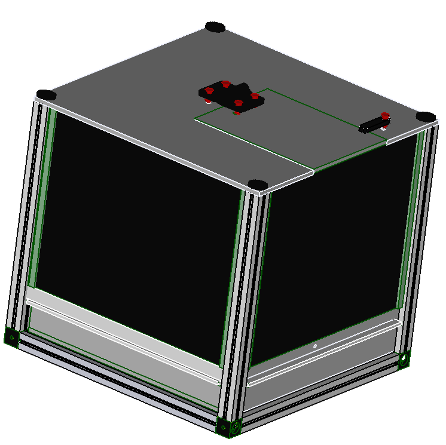

# Screens behavioural box

The box is used to research on mice reaction to different scenes played on the screens inside the box.

It uses an impliemtation of the beehive to check on the feeding of the mice.