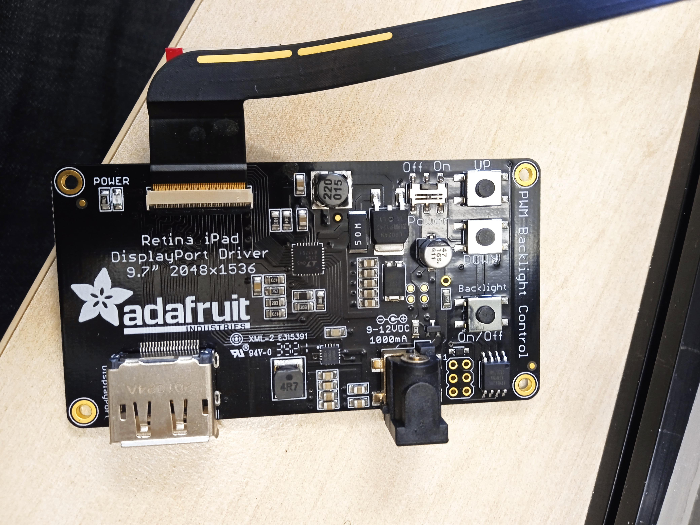
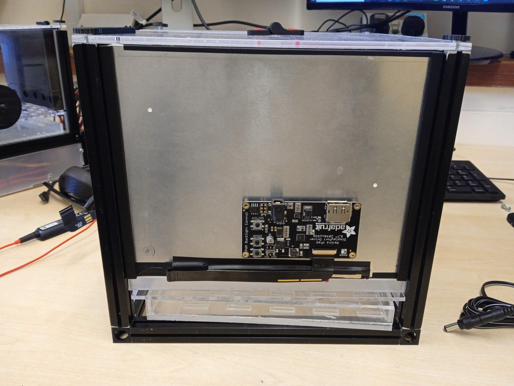
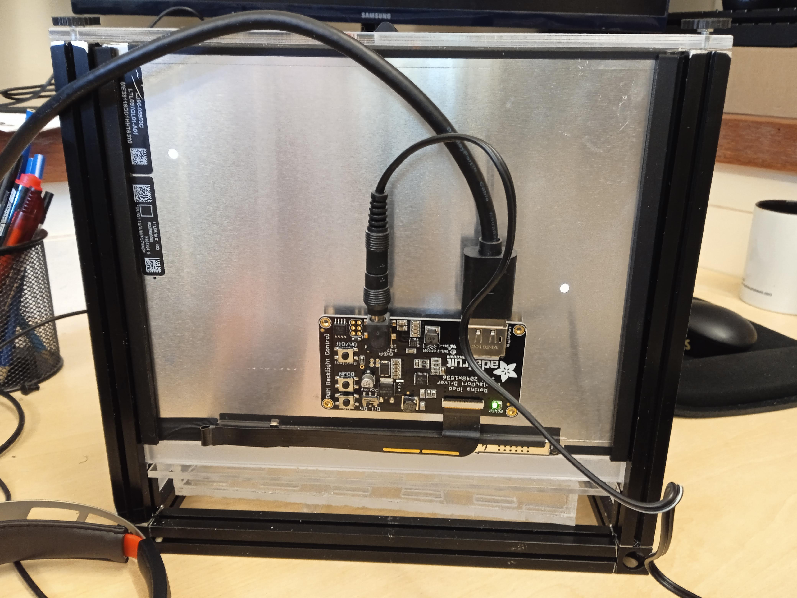

[Display driver]:Parts.yaml#Displaydriver
 [Black Hook & Loop Tape]:Parts.yaml#tape
[Display cable]:Parts.yaml#cable
[Adapter 9V dc Output]:Parts.yaml#Adapter

# Electronics

{{BOM}}

To easily connect and understand the eelectronics we will split it into two:
1. Display driver connection
2. Lick sensor

## Display connection {pagestep}

1. Connet the display ribbon cable to the [Display driver]{Qty:4}

 
2. Secure the display driver with [Black Hook & Loop Tape]{qty:1, cat: material} on the bak of the display

 

3. connect the [Display cable]{qty:4} and the [Adapter 9V dc Output]{qty:1}

The display cable is conected to the computer to acquire the images and for anlaysis purposes.

## Lick sensor {pagestep}

+ Its implimented using the Beehive board, which is a breakout board uising the esp32 as the microcontroller. The details can be found here: https://github.com/BeeHive-org/BeeHive.
+ By simply taping into one of the touch sensor pins on the esp 32 you can be able to monitor licks the animal makes whenever you dispense a liquid.