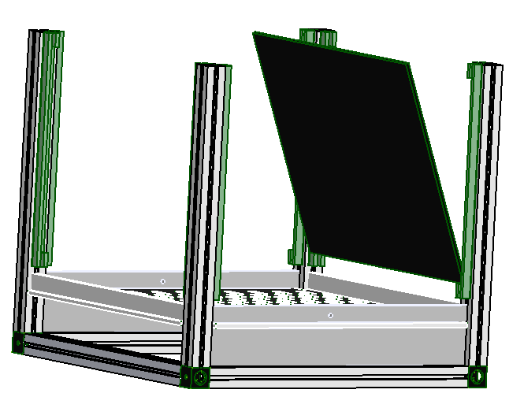
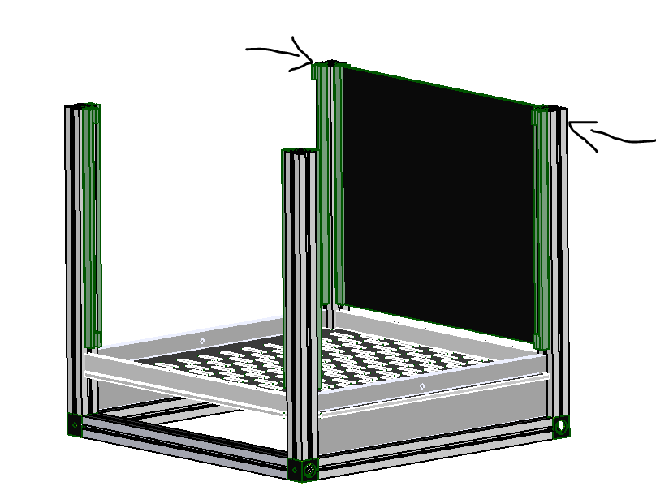
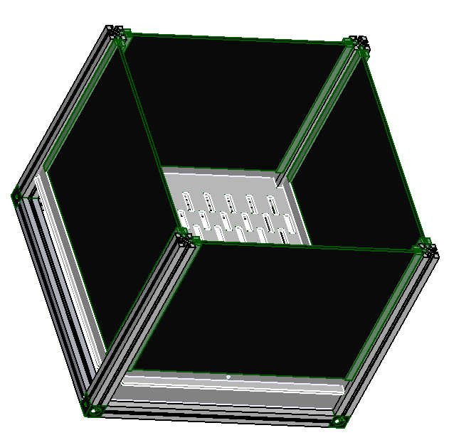
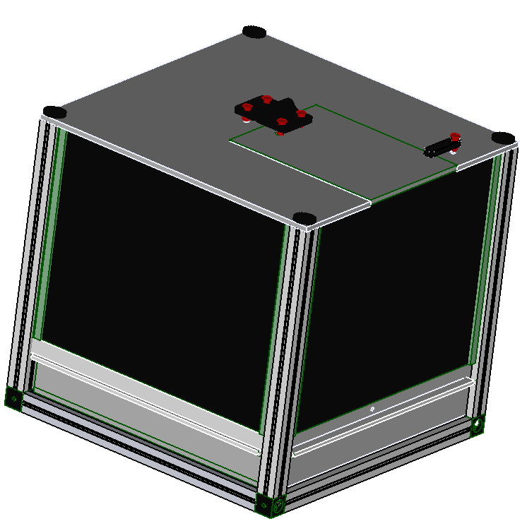

[3d printer]:Parts.yaml#3dprinter
[Laser cutter]:Parts.yaml#Lasercutter
[clear plastic sheet]:Parts.yaml#ClearSheet
[maker beam XL]:Parts.yaml#MakerBeamXL
[150mm mini hacksaw]:Parts.yaml#Hacksaw
[M3 tap set]:Parts.yaml#M3tapset
[tap wrench]:Parts.yaml#Tapwrench
[PLA filament]:Parts.yaml#PLAfilament
[M3x8 socket cap screw]:Parts.yaml#M3X8mmSocketcap
[Multi Angle Vice]:Parts.yaml#vice
[Liquid Adhesive]:Parts.yaml#Adhesive
 [2mm Hex key]:Parts.yaml#2mmHexkey
[3/4 retina display]:Parts.yaml#Display

# Building the box

{{BOM}}
>i you can skip step 1 and 2 if you bought the parts

## Printed parts {pagestep}
  + To accomplish this section you will need a [3d printer]{qty: 1, cat:machine} and [PLA filament]{Qty: 80g, cat: material} to print 

## Laser cut parts {pagestep}
 + This section requires a [Laser cutter]{qty: 1, cat:machine} and [clear plastic sheet]{Qty: 1, cat: material} to produce the following parts:
     1. 1pc [Lid and door](models/lid.svg)           
   2. 2pcs [Feeding_panel](models/Feeding_panel.svg)            
   3. 1pc [base](models/Base.svg)
   4.  2pcs [Filler_panel](models/Excrete_side.svg)
  5. 1pc [Excretion_base](models/Excrete_bottom.svg)
  6. 2pcs [Excretion_side](models/Excrete_side.svg)
  7. 2pcs [Excretion_front](models/Excrete_front_back.svg)

## Prepare the Makerbeam XL {pagestep}
+  Cut 8 pcs 210mm long form the [maker beam XL]{Qty: 1, cat: material}  using the [150mm mini hacksaw]{Qty: 1, cat: tool}.
+ Assemble the the first [M3 tap set]{Qty: 1, cat: tool} from the taping set to the [tap wrench]{Qty: 1, cat: tool}.
+ Tap the holes on the ends of the maker beam xl pieces that you had cut  ealier.

## Assembly {pagestep}
+ At this point you should have all the parts ready for assembly. Follow the steps to assemble the box:
   
   1. Assemble 4 makerbeam xl and 4 3d printed corners to make a square frame. Using [M3x8 socket cap screw]{Qty:12} fasten the corners to the maker beam xl uisng [2mm Hex key]{qty:1,cat:tool}.   
      

  2. Fasten 4 more maker beam xl horizontally on to the sqaure frame made in (step 1) using [M3x8 socket cap screw]{Qty:4}.  
     

 3. Slide the two [Feeding_panel](models/Feeding_panel.svg)   on to the opposite ends of the [base](models/Base.svg) as shown in the diagram.
      
 

 4. Slide the assembly made in (step 3) on to the assembly made in (step2) as shown.
    

 5. On the opposite sides of the assembly in (step 4), slide the  [Filler_panel](models/Excrete_side.svg). 
   

 6. Snap fit the screen sliders on the aseembly pillars. 
   

7. Slide the [3/4 retina display]{qty:4} on all the corners.Start by sliding in the base first at an angle as shown  
   

8. Straigthen up the screen and slightly nudge the pillars side ways to allow the screen to stand upright. 
    
 

9. Reallign the pillars to fit the screen into the screen sliders slots. 
  

10. Repeat (steps 6 to 8) to place all the screens. once all the screens are in place. The final assembly should look like the diagram below. 
     
    

11. Place the  [Lid and door](models/lid.svg)  on a flat surface and allign the printed hing plus latch with their respective holes as shown.
     
        

12. Align the fastener pins in place with the hole and press fit them to fasten the lid and latch on to the lid. 

   

   + Now the lid has all its aceesories, its time to attach it to the top of the box.

13. Take [M3x8 socket cap screw]{Qty:4} and using a [Multi Angle Vice]{Qty: 1, cat: machine} press the 3d printed thumbwheels on to the M3x8 socket cap screws..

14. place the assembled lid on top of the box and fasten it with the assembled M3x8 socket cap screws.

 

15. using [Liquid Adhesive]{Qty: 1 , cat: material} assemble the excretion panel and wait for it to dry. 

16. Once its dry slide it in to the space on the bottom of the box.

NB: The assembly is ready for use. The next steps will be to connet  the electronics.

